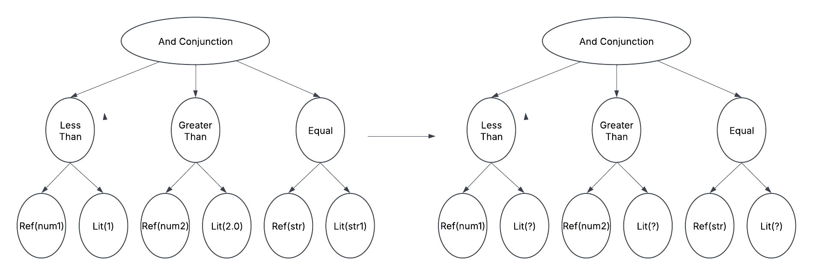

## Sql-Commons
It's a collection of functions for interacting with DuckDB 
- Connection Pooling 
- Query Parsing/Transformation
- Delta Lake/ Hive Partition pruning based on the query predicate
- Detecting similar queries (https://medium.com/@tanejagagan/ac5e00cb96b5)

## Requirement 
- java 17
- maven 

## Compile project
`./mvnw compile`

## Connection pooling

Start using DuckDB with
- Execute the query. `ConnectionPool.execute(sql)`
- Print the results. `ConnectionPool.printResult(sql)`
- Get Arrow reader for Reading. `ConnectionPool.getReader(sql)`
- It loads the connection property from `duckdb.properties` inside resources directory

## Transformation
- Read the sql tree with `Transformation.parseToTree(sql)`
- Various transformation change the query. Used for fingerprinting algorithms 

## Fingerprinting
Replace all the literals from the where clause of a query and hash the query.
Read more about it at https://medium.com/@tanejagagan/ac5e00cb96b5
- `./mvnw exec:java -Dexec.mainClass="io.github.tanejagagan.sql.commons.Fingerprint"`

## Delta Lake partition pruning
- `./mvnw exec:java -Dexec.mainClass="io.github.tanejagagan.sql.commons.delta.PartitionPruning"`

## Hive partition pruning
`./mvnw exec:java -Dexec.mainClass="io.github.tanejagagan.sql.commons.hive.HivePartitionPruning"`

## TODO Iceberg partition pruning

## Publish the project
- `export GPG_TTY=$(tty)`
- `./mvnw clean -P release-sign-artifacts -DskipTests deploy`
